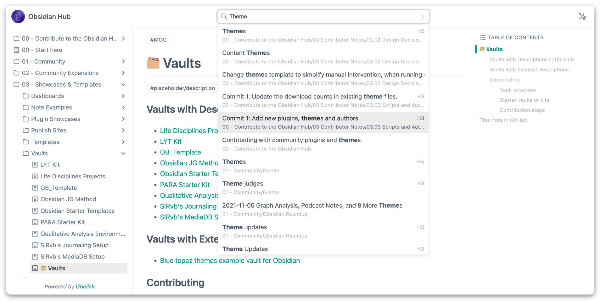
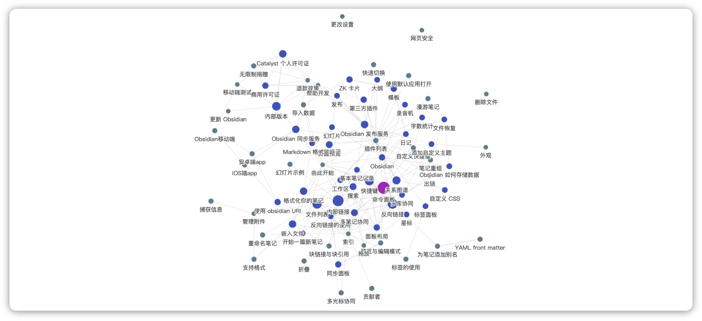

[English](https://github.com/cuigh/obelisk) | [中文](https://github.com/cuigh/obelisk/blob/master/README_zh.md)

Obelisk is a publishing tool for markdown document library, which can help you generate HTML documents simply and quickly. In particular, out of personal preference, Obelisk has made a lot of optimization for the [Obsidian](https://obsidian.md) document library, which can be used as an alternative to the official publishing service.

## Features

- Compatible with CommonMark, GFM Extensions etc
- Support custom themes
- Support document search
- Support back links
- Support some mainstream plugins of the Obsidian community
	- Excalidraw
	- Banner
	- Admonition
	- Icon Folder
	- ……

## Screenshots

**Document**

**Graph**

**Extensions**

## Getting Started

Please follow the [Documentation](https://cuigh.com/obelisk).

## Roadmap

- [x] CommonMark
- [x] GFM Extensions
- [x] Callout
- [x] LaTeX
- [x] Comment
- [ ] Embed
	- [x] Image
	- [x] Audio
	- [x] Video
	- [x] Excalidraw
	- [x] PDF
	- [ ] Markdown
- [x] Plugin
	- [x] Banner
	- [x] Excalidraw
	- [x] Admonition
	- [x] Icon Folder
- [x] Theme
- [x] Search
- [x] Back links
