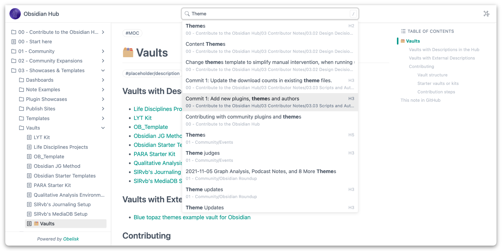
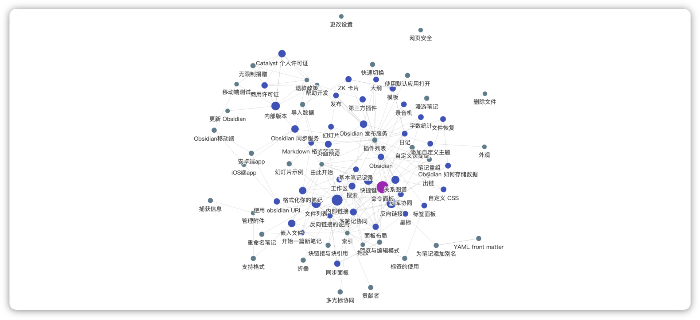
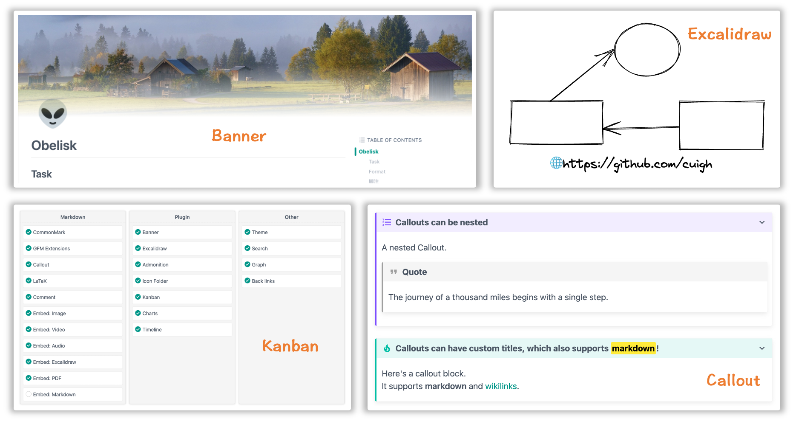

[English](https://github.com/cuigh/obelisk) | [中文](https://github.com/cuigh/obelisk/blob/master/README_zh.md)

Obelisk 是一个 Markdown 文档库发布工具，它能够简单、快速的帮你生成 HTML 文档。特别的，出于个人的偏爱，Obelisk 针对 [Obsidian](https://obsidian.md) 文档库做了大量的优化，可作为官方发布服务的一个替代方案。

## 主要特性

- 兼容 Markdown 标准规范及常用扩展规范
- 支持自定义主题
- 支持文档搜索
- 支持反向链接
- 支持 Obsidian 社区的一些主流插件
	- Excalidraw
	- Banner
	- Kanban
	- Icon Folder
	- ……

## 屏幕截图

**文档**

**图谱**

**扩展**

## 快速上手

请参考这里的 [使用文档](https://cuigh.com/obelisk)。如你所料，文档站点也正是用 Obelisk 生成的。

## 路线图

- [x] CommonMark
- [x] GFM Extensions
- [x] Callout
- [x] LaTeX
- [x] Comment
- [x] Embed
	- [x] Image
	- [x] Audio
	- [x] Video
	- [x] Excalidraw
	- [x] PDF
	- [x] Markdown
- [x] Plugin
	- [x] Banner
	- [x] Excalidraw
	- [x] Admonition
	- [x] Icon Folder
	- [x] Kanban
	- [x] Charts
	- [x] Timeline
- [x] Theme
- [x] Search
- [x] Graph
- [x] Back links
- [x] Tag links
